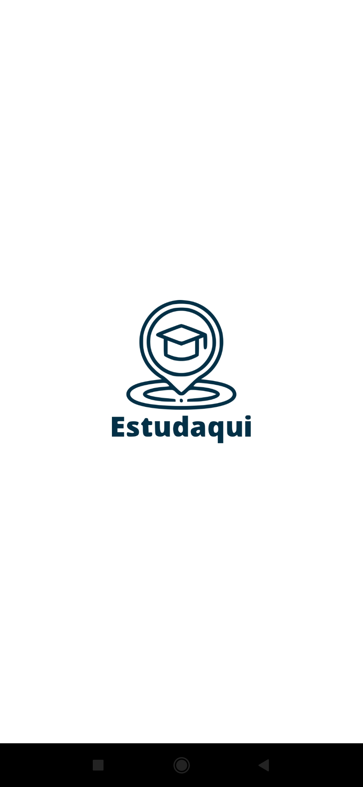
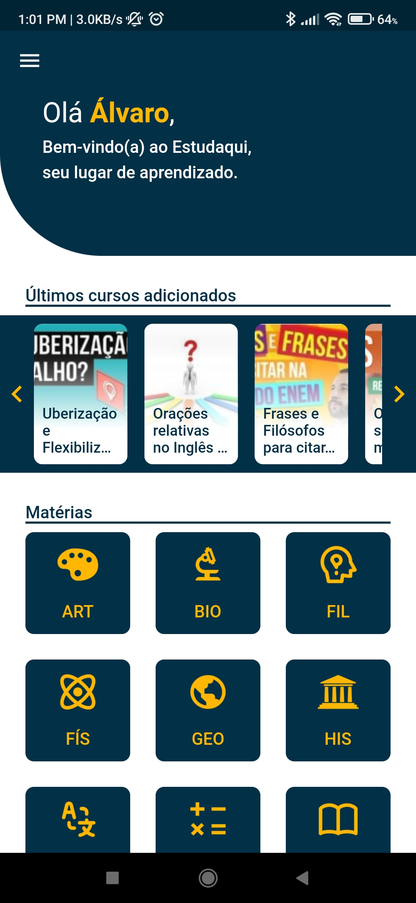
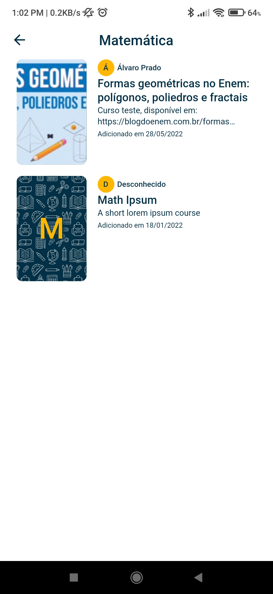
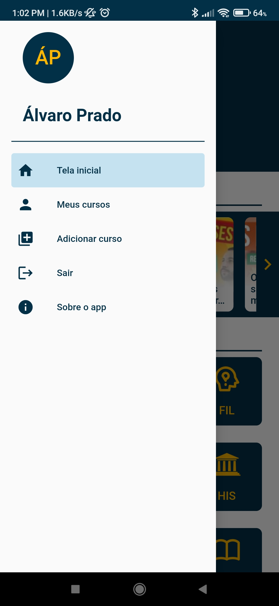
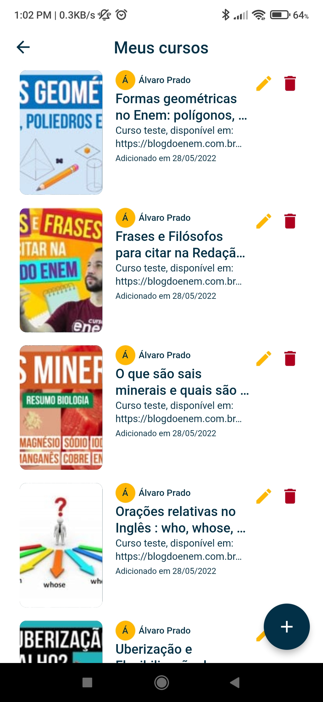
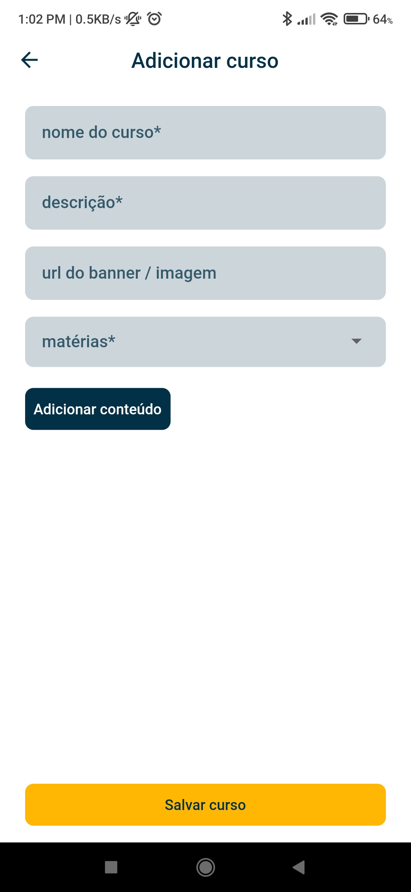
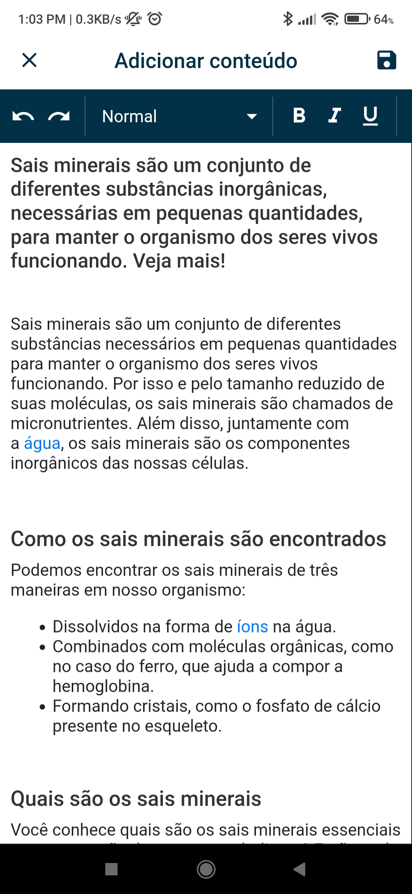
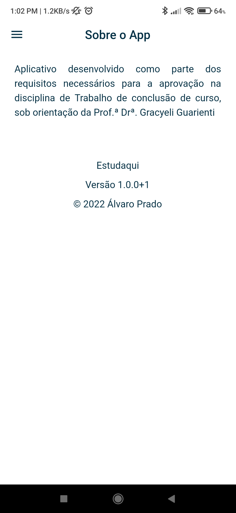
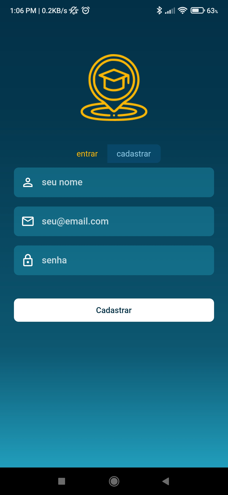

# Estudaqui

Aplicativo Flutter para auxiliar ao acesso e a disponibilização de conteúdos escolares.

## Funcionalidades

- **Autenticação**: Cadastro e login de usuários. Disponível a opção de login social com Google e Twitter.
- **Acesso aos cursos**: Acesso aos cursos disponibilizados.
- **Cadastro de cursos**: Cadastro de novos cursos para as disciplinas disponíveis.
- **Edição de cursos**: Edição de dados dos cursos cadastrados.
- **Remoção de cursos**: Remoção de cursos cadastrados.

## Principais dependências

- **Banco de dados**: [Firebase Cloud Firestore](https://pub.dev/packages/cloud_firestore).
- **Autenticação**: [Firebase Auth](https://pub.dev/packages/firebase_auth).
- **Gerenciamento de estado**: [Riverpod](https://pub.dev/packages/riverpod) + [Freezed](https://pub.dev/packages/freezed).
- **Navegação**: [GoRouter](https://pub.dev/packages/go_router).
- **Visualização dos cursos**: [Flutter Html](https://pub.dev/packages/flutter_html) + [Youtube Player Flutter](https://pub.dev/packages/youtube_player_flutter).
- **Criação dos cursos**: [Html Editor Enhanced](html_editor_enhanced).

##

          
